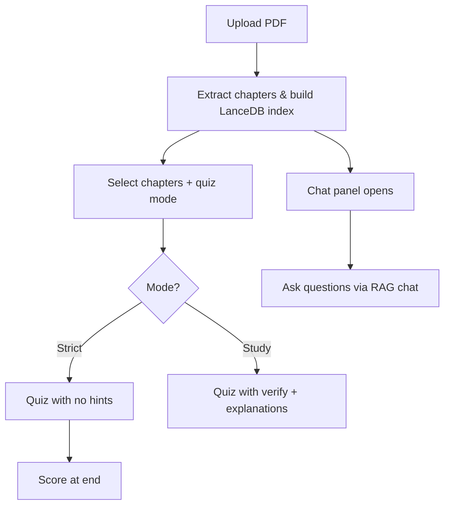

# Compagne

A PDF study companion that builds a RAG system with **LanceDB**, generates chapter-based quizzes, and provides a chat assistant grounded in your uploaded book.

## Tech Stack

| Layer | Stack |
|-------|-------|
| Frontend | React, TypeScript, Next.js, Tailwind CSS |
| Backend | Python, FastAPI, LangChain |
| Vector DB | LanceDB |
| LLM | OpenAI (embeddings + chat) |

## Features

- **PDF Upload** — Extract text, detect chapters, chunk and embed into LanceDB
- **Chapter Selection** — Pick which chapters to quiz on
- **Quiz Generation** — Question count scales with selected chapters (5 for 1 chapter, 4/chapter for 2–3, 3/chapter for more)
- **Strict Mode** — No verification during the quiz; score revealed at the end
- **Study Mode** — Verify each answer with explanation before moving on
- **Chat Assistant** — Opens automatically after successful indexing; answers questions via RAG

## Project Structure

```
compagne/
├── backend/
│   ├── app/
│   │   ├── main.py              # FastAPI entry point
│   │   ├── config.py            # Settings from .env
│   │   ├── models/schemas.py    # Pydantic models
│   │   ├── routers/             # API routes
│   │   └── services/            # PDF, vector store, quiz, chat
│   └── requirements.txt
├── frontend/
│   └── src/
│       ├── app/page.tsx         # Main app flow
│       ├── components/          # Upload, chapters, quiz, chat
│       └── lib/                 # API client & types
└── README.md
```

## Setup

### Prerequisites

- Node.js 18+
- Python 3.11 or 3.12 (recommended — 3.14 may lack prebuilt wheels for some deps)
- OpenAI API key

### Backend

```bash
cd backend
python -m venv .venv

# Windows
.venv\Scripts\activate

# macOS/Linux
source .venv/bin/activate

pip install -r requirements.txt
cp .env.example .env
# Edit .env and set OPENAI_API_KEY

uvicorn app.main:app --reload --port 8000
```

### Frontend

```bash
cd frontend
npm install
cp .env.local.example .env.local
npm run dev
```

Open [http://localhost:3000](http://localhost:3000).

## API Endpoints

| Method | Path | Description |
|--------|------|-------------|
| POST | `/documents/upload` | Upload PDF, index into LanceDB |
| GET | `/documents/{id}` | Get document metadata |
| POST | `/quiz/generate` | Generate quiz from selected chapters |
| POST | `/quiz/verify` | Verify a single answer (study mode) |
| POST | `/quiz/score` | Score full quiz (strict mode) |
| POST | `/chat/` | RAG chat over the document |
| GET | `/health` | Health check |

## User Flow



## Environment Variables

### Backend (`backend/.env`)

| Variable | Default | Description |
|----------|---------|-------------|
| `OPENAI_API_KEY` | — | Required for embeddings and LLM |
| `LANCEDB_PATH` | `./data/lancedb` | LanceDB storage path |
| `UPLOAD_DIR` | `./data/uploads` | PDF upload directory |
| `EMBEDDING_MODEL` | `text-embedding-3-small` | OpenAI embedding model |
| `LLM_MODEL` | `gpt-4o-mini` | OpenAI chat model |

### Frontend (`frontend/.env.local`)

| Variable | Default | Description |
|----------|---------|-------------|
| `NEXT_PUBLIC_API_URL` | `http://localhost:8000` | Backend API URL |
